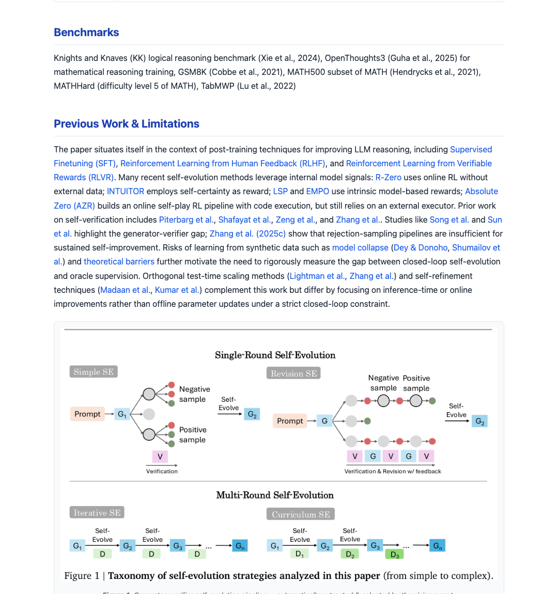
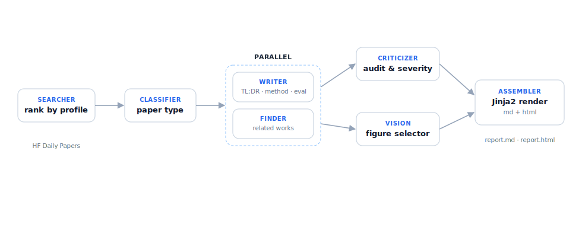
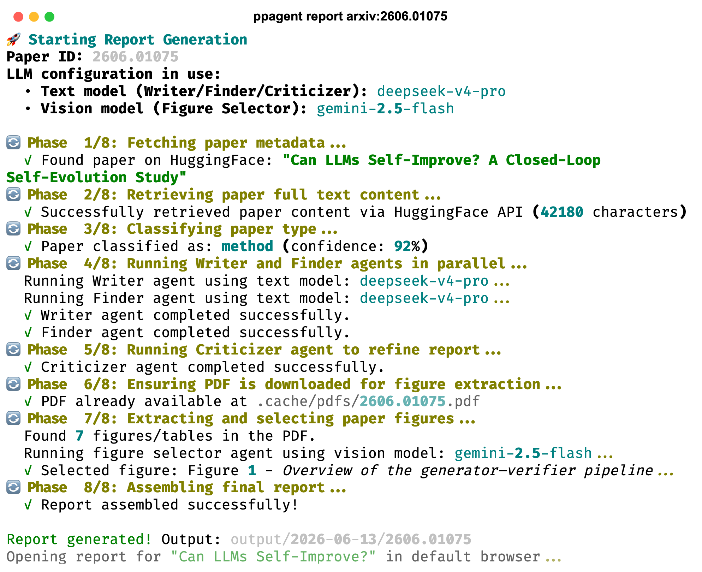
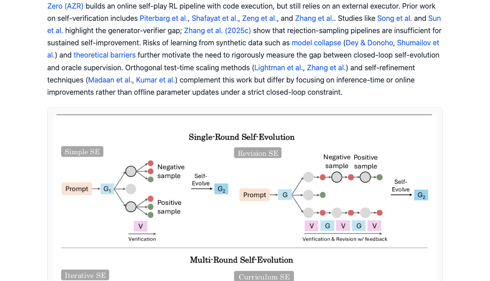
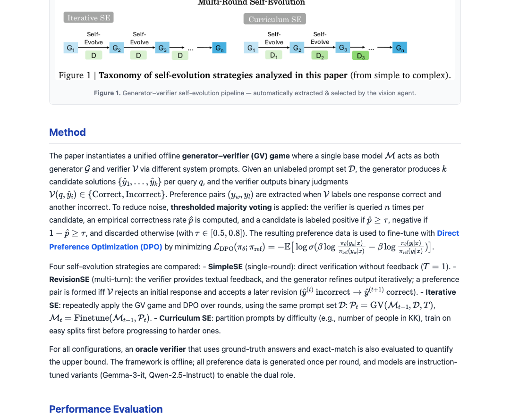
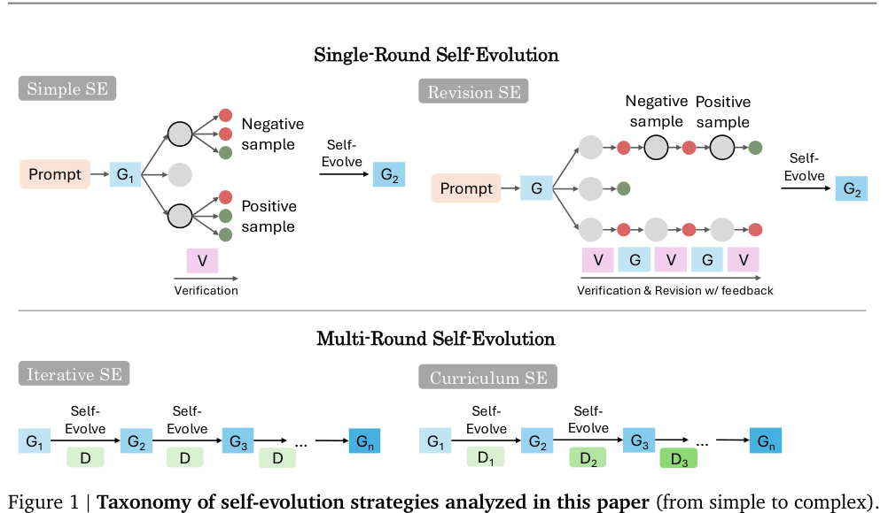

<div align="center">

# ppagent

**Turn any arXiv paper into a structured, illustrated reading report — in one command.**

A multi-agent pipeline: a **Writer** drafts the analysis, a **Finder** pulls related
work, a **Criticizer** audits claims, and a **Vision** agent picks the best figure
from the PDF. Everything is assembled into a clean Markdown + HTML report.

[Installation](#installation) · [Usage](#generate-a-report) · [Showcase](#showcase) · [How it works](#how-it-works)

</div>

<br>

<p align="center"><em>A report generated for <a href="https://arxiv.org/abs/2606.01075">arXiv:2606.01075</a> — TL;DR, metadata, and the vision-selected figure, all auto-produced.</em></p>

<p align="center">
  
</p>

---

## Installation

**macOS (one-liner):**

```bash
curl -fsSL https://raw.githubusercontent.com/AutoPhd-org/your-paper-reading-agent/main/install.sh | bash
```

**Manual** (requires [Python 3.12+](https://www.python.org/) and [uv](https://docs.astral.sh/uv/)):

```bash
git clone https://github.com/PhDeasy-org/your-paper-reading-agent.git
cd your-paper-reading-agent
uv sync
uv tool install "huggingface_hub[cli]"   # paper metadata source
```

Then **configure your LLM**:

```bash
ppagent config
```

This opens an interactive menu — pick a provider (OpenAI, DeepSeek, Gemini,
Anthropic, Qwen, GLM, …), paste your API key, and save. That's the only setup step.

<p align="center"></p>

---

## Generate a report

```bash
ppagent report arxiv:2606.01075
```

That's it. The command fetches the paper, runs all agents in parallel, and opens
the finished report in your browser.

<p align="center">
  
</p>

> The paper ID accepts any form — `2606.01075`, `arxiv:2606.01075`,
> `https://arxiv.org/abs/2606.01075`, or a `huggingface.co/papers/...` URL.

<details>
<summary><strong>All commands</strong></summary>

| Command | What it does |
|---------|--------------|
| `ppagent report arxiv:xxxx.xxxxx` | Generate a full report for one or more papers |
| `ppagent run` | Search today's trending papers by your profile, then report each match |
| `ppagent search` | Just discover & rank papers (no report) |
| `ppagent config` | Interactive settings menu (LLM, profile, output, scheduler) |
| `ppagent config show` | Print the active configuration |

Common flags: `report --force` (regenerate without prompting),
`run --schedule` (auto-run on a cron), `--verbose`.

</details>

---

## Showcase

Every report is a single self-contained HTML file (plus Markdown) with rendered
equations, linked citations, and the agent-selected figure.

<p align="center"><em>Method section — LaTeX equations render inline via MathJax; citations auto-link to arXiv.</em></p>
<p align="center"></p>

<p align="center"><em>Critical Analysis — every limitation is tagged by severity (<b style="color:#dc2626">HIGH</b> / <b style="color:#d97706">MEDIUM</b> / <b style="color:#6b7280">LOW</b>).</em></p>
<p align="center"></p>

<p align="center"><em>Figures are extracted from the source PDF, then a vision agent selects the most informative one.</em></p>
<p align="center"></p>

<details>
<summary><strong>What each report contains</strong></summary>

- **TL;DR** — one-paragraph distillation
- **Metadata** — authors, affiliations, keywords, benchmarks
- **Previous work & limitations** — contextualized, with linked arXiv citations
- **Method** — technical breakdown with rendered equations
- **Performance evaluation** — benchmark numbers and ablations
- **Critical analysis** — independent audit, severity-tagged
- **Related papers** — discovered by the Finder agent
- **Selected figure** — chosen by the vision agent from the PDF

</details>

<details>
<summary><strong>Discover papers automatically</strong></summary>

Edit `config/profile.md` with your research interests, then let ppagent find
relevant papers each day:

```bash
ppagent run                 # search + report today's matches
ppagent run --schedule      # ...on a daily cron
```

Reports are written to `output/<date>/<paper-id>/report.{md,html}`.

</details>

<details>
<summary><strong>Advanced</strong></summary>

- **Output language** — set `report.language` in the config menu (`中文`, `日本語`, `Français`, …).
- **Publishing** — push to Notion, a WeChat Official Account, or a blog webhook.
- **Custom agents & publishers** — drop a Python file in `~/.config/ppagent/agents/` or `…/publishers/`.
- **Per-role LLMs** — the Writer, Vision, and Searcher agents can each use a different model.
- **Environment overrides** — `PPA_LLM_API_KEY`, `PPA_LLM_BASE_URL`, `PPA_LLM_MODEL`.

</details>

---

## How it works

```
HF/arXiv paper
      │
      ▼
┌──────────┐   ┌────────────┐
│ Searcher │──▶│ Classifier │──▶ paper type
└──────────┘   └────────────┘            │
                                         ▼
            ┌────────────────────────────────────────┐
            │  Writer  ─┐                            │
            │           ├── run in parallel          │
            │  Finder  ─┘                            │
            └──────────────────┬─────────────────────┘
                               ▼
                    ┌─────────────┐   ┌───────────────┐
                    │ Criticizer  │   │ Vision: pick  │
                    │ (audit)     │   │ best figure   │
                    └──────┬──────┘   └───────┬───────┘
                           └────────┬─────────┘
                                    ▼
                          ┌──────────────────┐
                          │    Assembler     │──▶ report.md + report.html
                          │  (Jinja2 render) │
                          └──────────────────┘
```

---

## License

MIT
